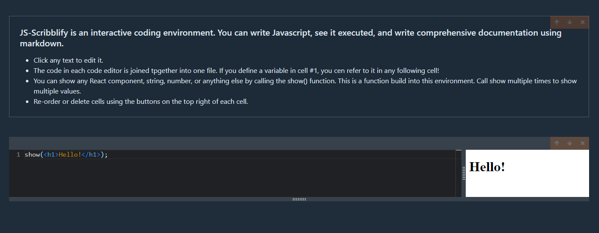

# JS-Scribblify

### JS-Scribblify is an interactive coding environment. You can write Javascript, see it executed, and write comprehensive documentation using markdown.

- Click any text to edit it.
- The code in each code editor is joined tpgether into one file. If you define a variable in cell #1, you cen refer to it in any following cell!
- You can show any React component, string, number, or anything else by calling the show() function. This is a function build into this environment. Call show multiple times to show multiple values.
- Re-order or delete cells using the buttons on the top right of each cell.

#### All of your changes get saved to the file you opened JS-Scribblify with. So if you ran `npx js-scribblify serve test.js`, all of the text and code you write will be saved to the `test.js` file

## 🍔 Getting started

Open whatever directory you want to save the file in and run `npx js-scribblify serve test.js`!

## 💥 Issues

This project was made while learning typescript and redux. The main issue came with publishing to npm.

## 👌 Collaborators

With instruction from Stephen Grider and his [course](https://www.udemy.com/course/react-and-typescript-build-a-portfolio-project/) on Udemy.

## ☕ License:

For more information about the license, click on the link below.

- [License](https://choosealicense.com/licenses/mit/)

## ❔ Questions:

For questions about this project you can go to my GitHub page at the following link:

- [GitHub Profile](https://github.com/Halvosaurus34)

For additional questions please reach out to me at: lhalvorson34@gmail.com.

---

## 🎯 Links

[JS-Scribblify GitHub Repository](https://github.com/Halvosaurus34/Eat-Da-Burger)

---

I used React, Redux, Typescript, Node and Express to build this cli.

---

## 👀 Screenshot

